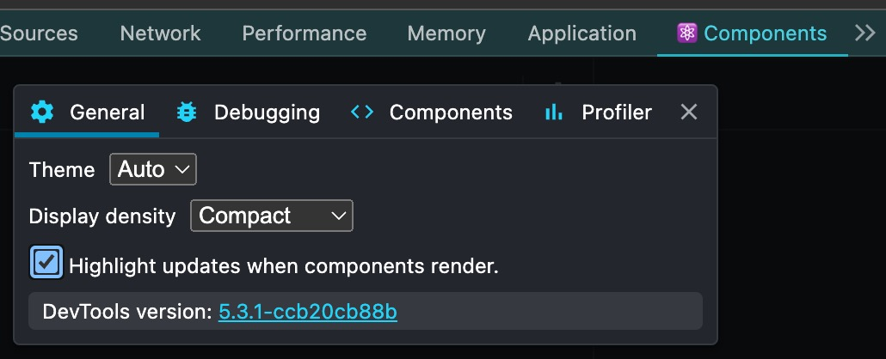

# Chrome DevTools

> Chrome 核心的瀏覽器皆可參考，包含 Edge、Opera 等。

## React Developer Tools

> [React DevTools](https://chromewebstore.google.com/detail/react-developer-tools/fmkadmapgofadopljbjfkapdkoienihi?hl=en-US&utm_source=ext_sidebar)

### 過濾多餘組件

- 齒輪 -> `Components` -> `Hide components where...` -> `Add filter` `name`

  新增三個 `^z$` `^O$` 與下面字串

  ```txt
  Root|Anonymous|LoadableComponent|ImageConfigContext|HeadManagerContext|HeadManagerContext|RouterContext|PathParamsContext|PathnameContext|SearchParamsContext|ReactDevOverlay|Container|ErrorBoundary|Provider|Provide
  ```

### 查看渲染頻率

- `Components` 打勾 `Highlight updates when components render`

  

## Redux DevTools

> [Redux DevTools](https://chromewebstore.google.com/detail/redux-devtools/lmhkpmbekcpmknklioeibfkpmmfibljd?hl=en-US&utm_source=ext_sidebar)

- 結合本專案 `defineStore` 除錯用
